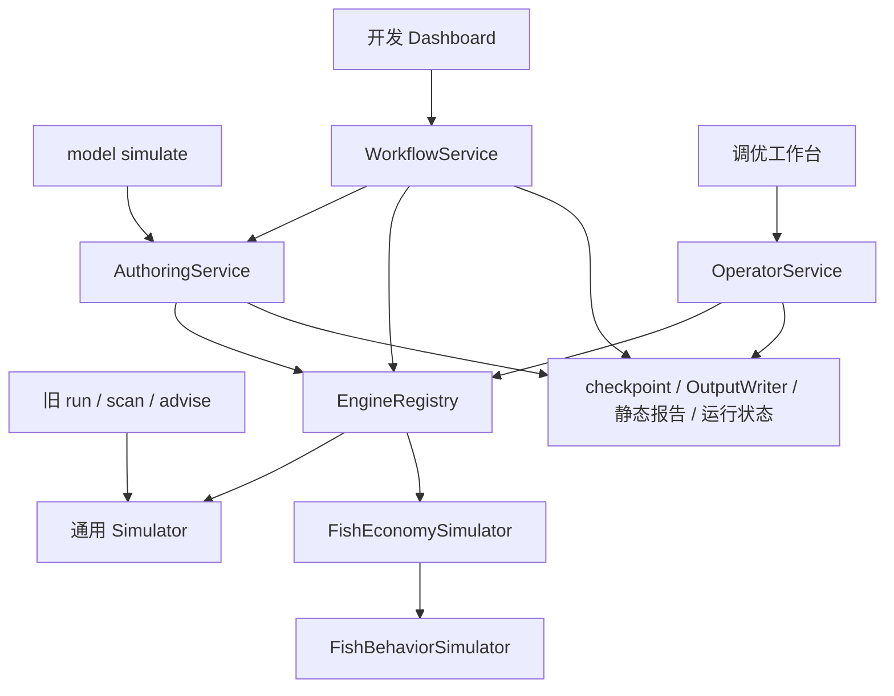

# IGESS 结构与可维护性评估

日期：2026-09-05。范围：当前工作区的源码、测试、入口、领域说明和分发 ADR。下文保留评估时的结构与证据；用户随后选择候选 A 并确认设计，已实施正式运行模块与开发诊断，见 `../formal-run-deepening/spec.md` 和 `../../docs/formal-runs.md`。

## 判断

有明确的优化空间，适合在持续使用中逐步整理。现有的引擎 Adapter、状态模型、领域命令、数据快照、checkpoint、事务和报告已经形成了可保留的基础。优先收益来自统一执行流程、保留失败上下文、缩小状态推进时需要理解的代码范围；仅移动目录不会解决这些问题。

本次统计 `src/igess` 下有 104 个 Python 文件、39,016 行，其中 40 个是平铺的 `fish_*.py`；`tests` 下有 65 个 `test_*.py` 文件。行数用于定位阅读热点，不作为设计质量评分。

## 当前结构与值得保留的部分

| 位置 | 当前职责 | 判断 |
| --- | --- | --- |
| `src/igess` 顶层 | 通用数值模拟、Fish 领域、入口编排、存储、分发 | 多种职责混放，已影响导航，但存在可利用的接口 |
| `src/igess/authoring` | 渐进建模、源表变更、锁、事务、导出、smoke、正式模拟 | 模块已成形；事务与快照能力应保留 |
| `src/igess/reporting` | 读取运行产物、构建视图、生成离线报告 | 通过产物读取的方式值得保留 |
| `projects/fish` | Fish 配置、场景、工作流脚本、项目说明和报告 | 游戏实例与工具源码已分开 |
| `tests` | 数值、领域命令、恢复、入口、报表、分发等测试 | 已有大量语义回归，重构可以利用 |

当前主要调用关系：



这些已有设计值得沿用：

- `engines.py:54` 的 `DomainEngineAdapter` 已有 Generic 与 Fish 两个实际 Adapter，接口有现实用途，无须另建一套插件框架。
- `fish_state.py` 以稳定导入路径封装状态、解析、验证和 codec，实现了迁移时保留旧入口的方式。
- `fish_*_commands.py` 已把投掷、升级、重生等操作从行为调度中拆出；继续围绕这些命令整理即可。
- `tests/test_fish_behavior_core.py:180`、`tests/test_fish_offline_sessions.py:143` 一带已有分段恢复与连续执行等价验证；`tests/test_fish_long_term_scenarios.py:55` 已验证原地状态更新与复制更新等价。这些比文件结构快照更能保护行为。
- 分发依赖闭包的只读检查得到 71 个 Python 模块，不含 `authoring`。保留这条隔离关系，可以让共享执行流程不把模型编辑能力带入执行工具包。

## 按收益排序的优化点

### 1. 统一正式运行流程，明确各命令支持的引擎（优先级最高）

**证据**

- `workflows.py:148`、`authoring/service.py:850`、`operator_runtime.py:349` 分别维护准备引擎、执行、写 checkpoint、写输出、生成报告、更新运行状态的顺序。
- `cli.py:539` 加载、验证和构建模型后，在第 545 行直接调用 `Simulator`；`scan.py:186` 和 `advice.py:34` 也直接调用它。
- 对当前 `projects/fish/economy.yaml` 和 `luban_exports` 做了只读加载，在内存中把 smoke 缩短到 1 秒，再沿旧入口的核心调用链执行。配置的 `engine_id` 是 `fish`，实际执行对象仍是通用 `Simulator`，产出 `unlock_activity` 通用事件，没有拒绝不支持的引擎。这不是完整 CLI 端到端复现，但已验证其核心调用链缺少引擎约束。

**维护影响**

新增一个产物、调整失败状态、增加恢复选项，需要同步修改多处。使用不同入口复现问题时，执行的流程甚至可能不同，容易把入口差异误当作数值差异。

**建议**

先对旧命令建立明确的引擎支持约定：仍只支持 Generic 的命令，遇到 Fish 应明确报错并指向支持的入口。不要顺带让扫描和建议功能声称支持尚未验证的 Fish 语义。

随后将三处正式运行的共同实现收进一个执行模块：调用者交付已准备的模型、选定 Adapter 和输出位置，由该模块完成运行生命周期、产物写入和失败记录。源码快照、authoring 锁与事务、执行工具包的输入限制，仍由各自调用者负责。

自动 smoke 与模型提交有事务关系，不应为了代码统一而改成先提交规则再运行。第一轮只收拢正式模拟的重复实现。

**验收**

- 在支持同一引擎、相同模型、画像、种子和输入语义的入口间，比较标准化结果与最终 checkpoint，排除运行 ID、输出路径等自然差异。
- 模拟失败、报告失败、状态落盘失败均得到一致且可归因的运行记录。
- 旧命令对不支持的引擎有明确诊断。
- 执行工具包依赖闭包仍不含 authoring。

### 2. 把开发诊断保留下来，使失败运行可定位、可复现

**证据**

- `authoring/service.py:1331` 的 `_phase_error` 对未分类异常返回阶段与异常类型，原始错误信息和调用栈没有在该路径持久保存。
- `workflows.py:225`、`operator_runtime.py:410` 将异常转换为运行状态中的字符串。
- `operator_runtime.py:263` 已能导出诊断包；执行工具包的安全错误编号和输入指纹机制应保留。
- Fish checkpoint 已包含模型摘要、场景、画像、随机种子、时间、行为状态等信息，复现基础存在。但引擎在正常返回后才交付最终 checkpoint，循环中途异常时该路径无法提供新的恢复点。

**维护影响**

单看 `simulation_failed` 或一段错误文字，经常无法判断是数据准备、调度、结算还是报表生成出错。需要重新运行并临时修改异常处理才能定位。

**建议**

在执行模块定义统一的诊断上下文：`run_id`、失败阶段、引擎、场景、画像、模型/输入摘要、种子、模拟时间、当前行为与目标、状态修订号、原始失败与后续落盘失败。运行记录引用诊断记录，而非仅存一句消息。

源码开发环境增加可选的详细诊断记录器：保存异常链与 traceback，并提供有限长度的最近事件上下文。模拟器在一致的状态节点上提供可选 checkpoint 捕获，使复现从最近有效状态开始。避免每一步复制完整玩家状态或默认保存无限日志。

这是开发环境能力。根据 ADR-0001/0002，执行工具包继续只产生业务诊断与清洗后的诊断包，不交付源码路径、traceback 或开发日志。共享接口可以相同，两种环境使用不同诊断记录器。

**验收**

- 人为注入一次结算异常，开发者可由运行 ID 找到准确阶段、异常链和最近有效状态。
- 报告生成失败能与模拟失败区分；后续记录失败不覆盖最初的失败证据。
- 相同输入和恢复点可重现异常；运行期间发生输入变化时，指纹检查能指出变化。
- 分发扫描及诊断包测试继续保证开发信息不进入执行工具包。

### 3. 缩小 Fish 行为循环的职责，并让运行逻辑直接读取数值事实

**证据**

- `fish_behavior_simulator.py:108` 的 `run_scenario` 长 535 行，同时处理初始化/恢复、在线离线切换、候选选择、行为完成、生产结算、事件、采样和最终 checkpoint。
- `fish_behavior.py:271` 的 `candidates` 长 175 行，`fish_behavior.py:447` 的 `complete` 长 234 行。
- `fish_behavior.py:94` 的 `FishBehaviorCompletion` 已是 dataclass，但部分运行事实只存在于 `details: dict[str, str]` 中；循环在 `fish_behavior_simulator.py:484` 读取字符串字段并转回整数，以更新生产计数。

**维护影响**

排查“离线结束时收益重复结算”或“突破完成与重生顺序”时，需要在一个大函数中同时跟踪多种状态。事件字段本应支持展示和归因，现在部分字段又反过来参与内部计数，改名或格式调整可能影响运行逻辑。

**建议**

保持现有 `run_scenario` 外部接口，内部形成三个清晰职责：初始化/恢复运行状态、推进到下一个模拟时点、收集报告与采样。把跨局部变量的运行状态聚合成明确对象，避免提取出需要十几个参数的碎片函数。

对现有 `FishBehaviorCompletion` 补充真正被内部消费的数值事实，例如结算时长、垃圾完成数量和突破完成记录；事件 `details` 由事实生成，内部计数不再从展示字符串解析。大数继续使用项目已有数值类型及序列化格式。

行为选择策略与领域命令继续分开。可以将每个已有行为的候选判断和执行关联起来，但暂时无须引入可动态安装的行为插件。

**验收**

- 固定种子的完整运行与分段恢复保持结果一致。
- 同一时点的行为完成、在线离线切换、采样顺序保持一致。
- 原地更新与复制更新仍等价；失败命令仍不部分修改状态。
- 重构前后比较代表性场景的耗时与内存，防止为可读性新增每事件全量复制。

### 4. 保留 RunRegistry 的小接口，把文件系统实现收进内部模块

**证据**

`run_registry.py` 共 2,477 行，公开的运行登记、查询、smoke 清理与底层实现写在一起。后半部分涉及原子写入、目录身份校验、隔离删除清单、删除恢复以及 Windows/POSIX 专属操作，例如第 532、888、1,631、1,841、2,070 行。

**判断与建议**

这里的复杂度有实际用途：持久化与安全删除需要正确处理路径变化和失败恢复。`RunRegistry` 的外部接口本身已经封装了很多复杂度，不应因为文件长而拆成一组要求调用者自己排序的接口。

适合在其内部按运行记录格式、原子存储、清理恢复、平台文件操作组织代码。只有 Windows/POSIX 这些实际不同的实现需要 Adapter；无须把每个文件操作包装成可替换接口。对外保留现有导入和方法。

**验收**

保留现有中断恢复、目录替换、非法路径、并发与平台删除相关测试。一次仅迁移一类内部实现，不同时重写清理算法。

### 5. 在职责明确后归类目录，并解除通用输出对 Fish 的直接依赖

**证据**

- 40 个 `fish_*.py` 与通用数值模块、工作台和分发模块平铺。
- `outputs.py:10` 直接导入 Fish 类型和进展报告；第 40 行依据 Fish 引擎、快照类型、设置决定是否生成领域产物。
- `reporting/loader.py` 和 `reporting/view_model.py` 同时处理通用与 Fish 报告。这一处集中并非错误，但今后扩展更多模型时会增加联动修改。

**建议目录（目标示意，非本次改动）**

```text
src/igess/
  cli.py                    # 保留命令入口与兼容导入
  application/              # 引擎装配、正式执行流程、运行诊断
  core/                     # 真正通用的数值类型、公式、时间与数据契约
  domains/
    generic/                # 当前通用模拟器及规则
    fish/                   # Fish 的 state、commands、data、behavior、simulation
  authoring/                # 模型编辑、锁、事务、导出与自动 smoke
  storage/                  # 运行历史库、内部存储与清理实现
  reporting/                # 通用产物读取、页面、离线资产
  operator/                 # 执行工具包运行入口、工作台与发布导出
```

先迁移 Fish 和运行历史库这类归属最清楚的模块；不必一次搬完顶层文件，独立 RNG/Stone 能力也不必强塞进一个尚未需要的统一引擎模型。

通用输出模块只写公共产物；引擎对应的产物实现负责 Fish 进展产物，并返回产物清单。报表侧继续读取文件，Fish 专属视图集中在明确子模块。引擎装配位置可以依赖各领域实现，通用数值模块不应反向依赖 Fish 或模型编辑流程。

迁移期间保留 `fish_state.py`、`engines.py` 等已有导入入口，参考当前 `fish_state.py` 的方式兼容。同步检查 `operator_export.py:191` 的依赖闭包分析、`operator_export.py:258` 附近的资产路径以及 `pyproject.toml` 的包数据配置。

静态导入检查还发现状态模型与解析/序列化之间的函数内反向导入，以及垃圾规则与结算间的类型检查导入。这些包含有意保留的兼容入口，不构成当前导入失败证据，优先级低于运行流程和诊断问题；不建议为了消除静态图中的环而立即大改。

### 6. 把日常验证做成可选择的固定入口

现有测试覆盖点很多，`external_data` 标记也已将外部导表快照测试从默认运行中隔离。可以基于这些现有测试逐步分出：

1. 日常快速回归：数值、领域命令、短时 checkpoint/行为等价。
2. 集成回归：建模事务、文件系统、CLI/Dashboard、报告与分发。
3. 生产数据验证：显式提供固定导表快照，验证 Fish smoke 及需要更新基线的长期场景。

提供一个统一的开发脚本，选定虚拟环境、测试分组和场景，不再依靠记忆长命令。按功能把测试目录逐步对应到源码职责即可，不需要按每个私有函数机械地拆测试。

本机 `.venv` 是 Python 3.13.11，而 ADR 的交付目标是 Python 3.11 x64。两者可以并存，但重构的发布验收应包含 3.11 执行工具包 smoke；开发环境通过不能单独证明交付环境兼容。当前分发测试在指定的本地 3.11 环境缺失时会跳过，因此持续验证时需要明确检查这一项是否实际执行。

## 建议实施顺序

| 阶段 | 范围 | 完成标志 |
| --- | --- | --- |
| 准备 | 诊断并处理本次发现的运行历史库测试失败 | 确立可重复通过的基线，或准确记录已知限制，避免重构掩盖原有问题 |
| 第一阶段 | 旧命令引擎约束、正式执行模块、开发诊断 | 同类运行只维护一处执行顺序；失败可凭运行 ID 定位 |
| 第二阶段 | Fish 循环内部职责与数值事实 | 可单独检查一次状态推进；恢复、边界时刻与现有数值语义等价 |
| 第三阶段 | Registry 内部实现、目录归类、领域产物接口 | 修改一个能力通常只需进入一个子目录；旧导入和交付仍可用 |
| 随各阶段进行 | 有针对性的语义回归与短场景验证 | 每一阶段独立可评审、可回退；目录移动与行为变更分开提交 |

第一批最值得做的是第一阶段。它能直接减少“不同入口结果不一致”和“报错后无法定位”的排查成本，后续再整理 Fish 循环时也更容易验证。

## 本次验证与范围

- 阅读领域说明与两个分发 ADR，抽查核心调用链、失败处理、状态推进、报告、存储和代表性测试。
- 对全部 Python 源文件做静态行数、函数长度、导入关系检查；对分发模块闭包做只读检查。静态导入图包含函数内及类型检查导入，不等同于运行时导入故障。
- 完成上述 1 秒内存探针，不写生产数据、不生成新的正式数值报告。
- 默认测试命令：`.\.venv\Scripts\python.exe -m pytest -q --durations=10`。结果：**1,366 passed、1 failed、6 skipped、16 deselected，耗时 240.01 秒**。16 项外部数据测试由默认标记排除。
- 唯一失败项：`tests/test_run_registry.py::test_write_status_parent_swap_never_writes_payload_or_temp_outside_registry`。测试期望目录被替换时抛出含 `changed/outside/parent` 的 `ValueError`，实际在 `run_registry.py:562` 抛出 `OSError: unable to allocate a private run-status temporary file`。随后分别用 Python **3.13.11** 和本地交付构建环境 **3.11.9** 单独复跑，均重复出现同一失败。当前已确认异常类型与预期不符；未完成根因诊断，不能仅据此认定发生了越界写入。
- 未进行长期生产场景重跑、完整逐行审计或性能基准，因此本文的模块收益判断不代表已测得的性能提升。
- 本次新增评估文档；已有 `projects/fish/RoadMap.md`、`src/igess/fish_throw_data.py`、`tests/test_fish_throw_commands.py` 的未提交修改与未跟踪的 `uv.lock` 均纳入当前工作区背景，没有修改它们。
