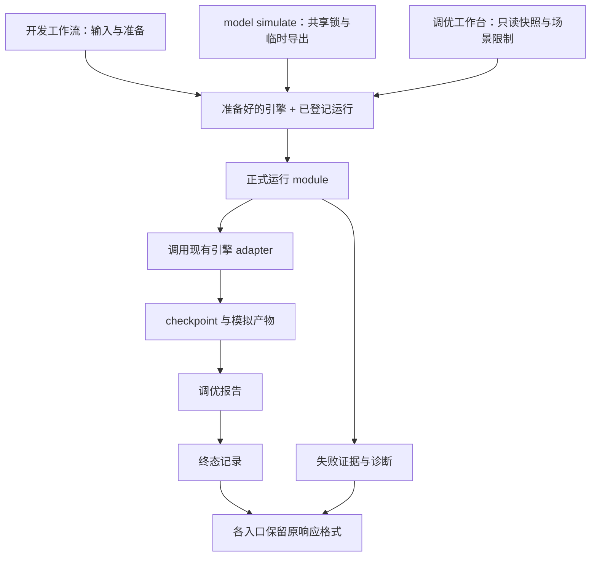

# 深化正式运行 module

设计状态：用户已确认全部推荐取舍及整体方案（“符合”）。实现与回归验证已完成。

## 目标

把正式运行的执行、checkpoint、模拟产物、调优报告和终态记录收进一个 deep module。调用者不再各自维护这段顺序及失败处理，让同类问题通过相同执行路径复现，并能从运行 ID 找到失败证据。

本设计承接架构候选 A，参考当前工作区代码与领域词汇表。候选 B 的 Fish 结算事实、候选 C 的调优报告口径不在本轮范围。

## 已确认的行为

用户于本次设计讨论中选择全部推荐项：

1. 旧 `run`、`scan`、`advise` 保留通用模拟用途；遇到 Fish 或其他不支持的引擎明确报错，指向支持的运行入口，不隐式使用通用模拟器。
2. 模拟完成但 HTML 报告失败时，整次正式运行仍为失败；保留已生成的模拟数据和 checkpoint，明确记录失败发生在报告阶段。
3. 源码开发环境失败时自动保存开发诊断，通过运行 ID 关联。执行工具包继续遵守 ADR-0001/0002，只保留业务诊断和清洗后的诊断包。

领域词汇以根目录 `CONTEXT.md` 的“正式运行”为准。

## 现有差异是 interface 的一部分

| 入口 | 保留的行为 |
| --- | --- |
| 开发工作流 | 准备引擎前登记运行；返回 `RunRecord`；Generic 的旧产物元数据格式保留；Fish 继续记录引擎和模型摘要 |
| `model simulate` | 准备引擎后预留目录并登记运行；返回原有版本的 `CommandResponse`；Generic 的状态、manifest、报告保留模型摘要，成功响应 result 的字段集合保持原样 |
| 调优工作台 | 只读导表快照；限制为预设场景；追加工具版本、输入指纹与业务诊断；成功后才执行比较与回归检查；继续使用运行历史库 |

锁、输入来源、运行登记时点、响应格式以及分发清洗规则不会因为共享 implementation 而被统一成同一种策略。

## seam 的位置

第一轮的共同 seam 位于“引擎准备完成且运行已登记”之后。



这个范围刻意保留准备前/后登记运行的现有差异，避免一个共同 module 需要接受大量排序开关。它仍封装了三处重复的执行、产物和失败处理，具有实际 leverage。

### 调用者继续负责

- 发现项目、校验输入权限和场景范围，获取锁、恢复建模事务、准备临时导出或运行快照。
- 加载、校验、构建模型，选择画像及引擎 adapter，准备模型摘要。
- 按原有时点预留运行目录、写入初始状态；向共同 module 交付记录和必要元数据。
- 将结果转换成原有入口响应；调优工作台追加其比较、回归与诊断包信息。

`model simulate` 在现有共享锁和临时导出上下文内同步调用共同 module。报告生成、终态记录仍发生在退出这些上下文之前；本轮不提前释放锁。

### 正式运行 module 负责

- 调用现有 `DomainEngineAdapter` 执行场景。
- 依序写 checkpoint、公共与已有领域产物、静态报告，并记录最终状态。
- 追踪内部执行阶段，归因失败，保留首个异常及随后发生的诊断或状态写入异常。
- 保留已写出的模拟产物；失败路径不删除运行目录来制造“没有失败”的表象。
- 向入口返回结果与失败信息，入口不再重复实现上述顺序。

### interface 的候选形状

建议新增 `src/igess/formal_run.py`，对外提供一个执行操作。下面是概念形状，类型字段在实现时依据现有对象收敛：

```python
outcome = executor.execute(prepared_run)
```

`prepared_run` 聚合已准备的引擎及其 adapter、场景、已有运行记录、可选恢复输入、override 归因及输出元数据。调用者提供的内容限于原本就拥有的运行事实，不传入“先写哪个文件”“失败后调用哪个回调”一类顺序知识。

`executor` 在入口装配时接受运行历史库、产物写入、报告生成和诊断所需依赖；默认使用现有 implementation。沿用现有测试中的真实临时目录和可替换写入器，不为只有一个 implementation 的每个步骤新增 Protocol。

`outcome` 保存最终运行记录（若可写）、失败阶段、首个失败与次级失败证据。返回已有运行记录的入口继续返回相同类型；需要 `CommandResponse` 的入口继续在自己的位置转换响应。

Generic/Fish 继续使用已有真实 adapter。开发诊断与执行工具包业务诊断确有不同用途，但详细开发诊断 implementation 不进入执行工具包的依赖闭包。

## 失败与诊断

### 内部阶段更精确，外部合同保持兼容

内部区分引擎执行、checkpoint、模拟产物、报告、终态记录。保留现有公开错误码和既有 `details.phase` 的含义；需要更精确的定位时，通过诊断记录和附加诊断关联字段表达，例如报告失败明确标记内部阶段为 `report`。

开发入口原有错误文字和调优工作台的清洗规则继续由相应入口处理。成功响应不增加字段，尤其保持 authoring Generic 成功 result 的固定字段集合。

### 开发诊断记录的默认内容

- 运行 ID、引擎、场景、画像、模型摘要和已有输入指纹。
- 配置或 checkpoint 的来源引用、已有随机种子与运行上下文。
- 精确失败阶段、异常类型、异常链、traceback、已生成产物位置。
- 发生次级诊断/状态写入失败时，首个异常继续作为主要失败证据。

首版只使用执行编排已经拥有的信息。引擎异常没有提供模拟时间、当前行为或最近事件时，明确标记不可得；本轮不修改 Fish 循环以定期复制完整状态，也不增加自动重放或一键重建报告功能。

详细诊断保存在源码开发项目的 `.igess/diagnostics/` 中，与对外调优报告分开。已分配运行 ID 时用该 ID 关联；准备或预留之前失败时使用独立诊断编号，避免为诊断而改变 authoring 的运行登记时点。记录保存位置应可在失败信息中找到。

输入准备阶段仍在共同执行 module 外，但相应入口的失败捕获可以使用同一开发诊断能力。开发诊断本身写入失败时，保留可输出的主要异常和诊断写入失败提示，不能伪报成功。

### 执行工具包

继续使用业务诊断与现有诊断包。源码路径、traceback、开发诊断文件不写入调优报告或执行工具包运行历史；只有用户显式选择时才附带完整导表快照。保持现有导出依赖闭包、白名单检查与离线资产规则。

## 旧入口引擎约束

约束覆盖实际可被调用的运行路径，不只放在 CLI 参数分支：

- 旧 `run` 保持现有通用模拟与输出方式。
- `run_scan` 在创建扫描候选或写入结果前明确检查引擎支持范围。
- `run_advice` 在启动模拟前明确检查引擎支持范围。

诊断说明配置声明的引擎不受该命令支持。对 Fish 正式模拟可指向 `model simulate`；不声称该入口提供旧扫描或建议功能的完整替代。

## 验证方式

测试跨现有 interface 检查可观察结果，不镜像新私有函数的拆分。

1. 三个入口在各自支持的相同模型、场景和种子下，模拟结果及 checkpoint 等价；各自原有响应和元数据格式保留。
2. Fish 恢复、override 归因、manifest 产物清单、报告关联与模型摘要保持正确。
3. 模拟完成、报告失败：终态 failed，已写数据与 checkpoint 保留，开发诊断定位到 report；调优工作台信息继续清洗且不执行比较。
4. 执行失败后终态写入又失败：保留首个异常和次级异常；现有对外错误码行为保持兼容。
5. 开发诊断写入失败：不能覆盖主异常或误报成功；准备前失败仍可归因。
6. 旧 Generic 命令、文档示例和产物继续工作；旧入口拒绝 Fish，并在扫描写出候选前失败。
7. 共享锁、恢复、临时导出、目录预留和清理自有空目录的现有测试继续成立；自动 smoke 的事务测试保持原语义。
8. 使用 Python 3.11 验证执行工具包依赖闭包、发布候选检查及运行 smoke，确保开发诊断没有被带入分发产物。

现有语义测试优先保留。只因 implementation 提取而失去意义的私有调用细节断言，可在等价的 interface 测试成立后调整；不会为了得到通过结果放宽业务或文件系统断言。

## 实施分段

1. 独立诊断当前 RunRegistry 目录替换测试失败，确认其根因与最小处理方式，记录重构前基线；不与本次执行模块提取混写。
2. 加入旧入口引擎约束，以及正式运行中报告失败、次级异常的 interface 测试。
3. 提取共同正式运行 module，迁移三个入口，保留各自输入与响应合同。
4. 接入开发诊断并验证执行工具包隔离。
5. 跑相关回归、默认测试和 Python 3.11 执行工具包检查，记录与已知基线的差异。

本轮不实施目录大搬迁、RunRegistry 删除算法重写、Fish 状态推进重构、跨版本比较或新引擎扫描能力。

## 当前证据

- 三处共同实现：`src/igess/workflows.py:148`、`src/igess/authoring/service.py:850`、`src/igess/operator_runtime.py:349`。
- authoring 响应及摘要合同：`tests/test_authoring_service.py:309`、`:576`；Fish 正式运行与恢复：`tests/test_fish_engine.py:270`、`:364`。
- 已有业务诊断与输入约束：`tests/test_operator_toolkit.py:76`、`:138`。
- 重构前默认测试：1,366 passed、1 failed、6 skipped、16 deselected。唯一失败是 RunRegistry 目录替换测试，Python 3.13.11 与 3.11.9 单独复跑均出现同一异常类型不匹配。
- 已定位该失败：Windows 在临时文件创建期间发生父目录替换时可能返回 `FileExistsError`，原实现误当成随机文件名冲突并继续重试。现于该分支重查目录绑定，发现替换立即拒绝；未改动删除算法。注册库测试 36 passed、3 skipped，Python 3.11 的原失败测试单独复跑通过。
- 已新增报告失败、checkpoint 恢复、次级异常、诊断写入失败、准备期 attempt 诊断、三个入口的 Generic 产物等价和执行工具包隔离测试；重点回归首轮 27 passed。
- 默认完整回归：Python 3.13.11，`python -m pytest -q --tb=short`，1,384 passed、6 skipped、16 deselected，耗时 253.95 秒。16 项外部数据测试按仓库默认配置排除，未借此声称验证真实生产数据。
- 完整回归后补充了 3 项边界用例：临时导表清理异常（有/无在先报告异常）2 项在 Python 3.13.11 通过；实际 sourceless 工具包正式模拟及报告失败清洗 1 项在 Python 3.11.9 通过。清理异常处理继续保留已有模型上下文与最早异常。
- Python 3.11.9 的正式运行、工具包、注册库和 Fish 引擎回归：70 passed、3 skipped、2 deselected，包含实际导出和发布候选扫描。末轮 authoring 全文件及实际 sourceless 工具包运行回归：57 passed，耗时 101.45 秒，覆盖最终清理异常处理。
- 实现与调试入口见 `docs/formal-runs.md`。`git diff --check` 已通过；保留工作区原有的 Fish 投掷规则、测试、RoadMap 与 `uv.lock` 改动。
