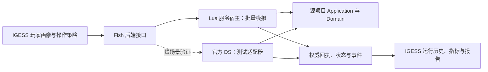

# Fish 源码复用与服务器驱动模拟：重构研究

研究日期：2026-09-24。结论：**值得启动分阶段重构，优先让 IGESS 调用源项目 Lua 业务服务，真实 DS 用于关键流程的一致性验证。现有证据不足以承诺完整服务器可独立高速运行，更不足以承诺“100% 真实玩家数值体验”。**

后续实施决策：用户确认不依赖完整 DS，直接由本地执行器运行源项目 Lua 业务服务；DS 对照仅是将来可选的强化验证，不属于[实施规格](../../../.scratch/fish-source-runtime/spec.md)的验收门槛。

本次仅研究、读取源码并执行已有 Lua 测试，没有修改游戏或 IGESS 运行逻辑，没有启动 PIE、连接线上玩家存档或发布执行工具包。

## 1. 要解决的实际问题

当前架构共享数值表，但不共享业务实现：`FishEngineAdapter` 从生成 Python schema 和生产 JSON 构建 `FishDataSnapshot`，之后进入 Python Fish 模拟器；生产、投掷、扣款、重生和玩家状态由 IGESS 自己执行。[IGESS 引擎入口](../../../src/igess/engines.py)、[Fish 模拟器](../../../src/igess/fish_behavior_simulator.py)、[生产结算](../../../src/igess/fish_production.py)

因此，改价格等已有字段通常只需重新导表；改 Lua 规则、增加养成状态或改变行为时序，仍须修改 Python。RoadMap 中卖鱼、金币升级、半秒杠铃的逐次迁移就是这笔持续成本。[现有进度](../RoadMap.md)、[半秒周期验证](../../../.scratch/fish-barbell-subsecond/verification.md)

源项目已具备比“只有脚本的完整 UE 工程”更好的条件：`proj/Script/Domain` 保存经济计算与状态规则，`proj/Script/Application` 保存业务命令、结算、存档事务和会话；多个服务支持依赖注入，测试直接 `require` 这些生产文件。无需先把整个游戏推倒重写才开始复用。[杠铃服务](E:/fish-oasis/proj/Script/Application/BarbellProgressionService.lua)、[测试初始化及业务命令](E:/fish-oasis/tests/barbell_progression_service_test.lua)

## 2. 已确认的差异与可复用基础

| 检查项 | IGESS 当前实现 | 源项目当前实现 | 意义 |
| --- | --- | --- | --- |
| 鱼厅金钱 | 结算直接增加 `wallet.money` | 先累计 `fishHall.slotBalances`，领取命令才增加钱包；一键领取检查特权 | 即使每秒产量相同，可支付时间也可能不同 |
| 摆鱼 | 模拟器按固定最高收益策略自动重排 | 服务提供放入、取出、移动、交换、最佳收益/潜力摆放等显式命令 | 策略应决定什么时候操作，结果由游戏命令决定 |
| 杠铃时间 | 60 秒行为内按速度积分；全局整数秒 | `ExerciseClock` 毫秒精度，周期次数由 `ExerciseTiming` 计算 | 当前 0.5 秒整除区间不代表所有周期、停止时点均等价 |
| 投掷 | 模拟器直接生成投掷结算 | `FishThrowService` 含准备、飞行、选落点、完成、过期、会话等流程 | 只调用概率函数不能覆盖真实投掷的校验和提交 |
| 数值/RNG | Python 数值与概率实现 | 原生 Lua `BigNumber`、`DomainRandom` 和独立 seed provider | 可消除重复实现；仍须约束 VM、种子和事件顺序 |

上述对比来源：[Python 正式生产结算](../../../src/igess/fish_production.py)、[Lua 槽位生产](E:/fish-oasis/proj/Script/Domain/Production/FishHallProductionCalculator.lua)、[Lua 实际生产提交管线](E:/fish-oasis/proj/Script/Domain/Production/PlayerProduction/PlayerProductionSettlementPipeline.lua)、[领取与特权](E:/fish-oasis/proj/Script/Application/FishHall/FishHallCommand.lua)、[鱼厅服务](E:/fish-oasis/proj/Script/Application/FishHallService.lua)、[IGESS 周期边界说明](../README.md)、[锻炼时钟](E:/fish-oasis/proj/Script/Application/BarbellProgression/ExerciseClock.lua)、[完整周期计算](E:/fish-oasis/proj/Script/Domain/Barbell/ExerciseTiming.lua)、[投掷服务](E:/fish-oasis/proj/Script/Application/FishThrowService.lua)、[落点校验与重算](E:/fish-oasis/proj/Script/Application/FishThrow/ThrowLanding.lua)。

鱼厅差异是源码层面已确认的行为差异，尚未测量其对 7 天成长曲线的影响。不要把它解释为已经定位某份历史报表的全部误差。

另一个审阅发现：游戏 `CONTEXT.md` 将鱼升级描述为资源消耗，而当前 `PlayerInventory/InventoryCommand.lua` 仍调用 `WalletDraft.SpendMoney`。因此本报告按可执行源码判断，不把文档描述当作已完成的业务变更。[游戏领域文档](E:/fish-oasis/CONTEXT.md)、[实际升级命令](E:/fish-oasis/proj/Script/Application/PlayerInventory/InventoryCommand.lua)

### 本次实际执行的证据

运行目录 `E:\fish-oasis`；解释器为本机 `lua`，报告版本 `Lua 5.5.0`；命令为 `lua tests/<name>.lua`。每个文件使用独立进程。

| 已有测试 | 结果 |
| --- | --- |
| `barbell_progression_service_test.lua` | 通过 |
| `fish_hall_service_test.lua` | 通过 |
| `player_production_runtime_test.lua` | 通过 |
| `fish_throw_service_test.lua` | 第 1906 行失败：历史境界材料收益，expected 9 / actual 18；此前还有排行榜配置不可用警告 |
| `throw_outcome_resolver_test.lua` | 第 344 行失败：生产变异权重，expected 100000 / actual 99577 |
| `offline_reward_service_test.lua` | 第 298 行失败：待领取材料，expected 0 / actual 1 |

测试文件均在[源项目 tests](E:/fish-oasis/tests)。三项通过证明相关生产服务能在引擎外配合测试宿主执行；三项失败原因尚未诊断，不能断言是生产 bug、Lua 版本问题或仅仅旧 fixture。部分测试会在进程内改表或注入依赖，**这不是完整正式生产模拟，也不是 DS 一致性验证**。

检查时 IGESS HEAD 为 `fb8bc9f0f12659493fc01f0f7d551ef2c7d5307b`，Fish HEAD 为 `a586aacb62c8844ebd786f06ba78edfc4c82e060`；两边都有原有未跟踪文件，引用的是当时工作区内容，不能宣称是纯净提交快照。

## 3. 三种方案如何选

| 方案 | 消除重复规则 | 快速长周期模拟 | 引擎与网络覆盖 | 评价 |
| --- | --- | --- | --- | --- |
| 继续维护 Python 镜像 | 否 | 已有能力 | 无 | 保留作迁移对照，继续扩充的长期收益偏低 |
| **源 Lua 服务 + 可控宿主** | 是，已接入范围调用同一份代码 | 有实现基础，性能待测 | 需另做 DS 验证 | **推荐作为主要数值后端** |
| 完整官方 DS + 模拟玩家/测试客户端 | 是，执行实际服务进程 | 官方可控时钟、独立启动和吞吐均未证实 | 更接近完整运行环境 | 用于短场景验证；暂不作为长周期唯一后端 |

这里的“可控宿主”是启动 Lua、提供时钟/定时器/内存存储/玩家上下文，再调用原业务服务的薄适配层；不是重新写一套收益公式，也不是给每个 UGC API 都造假对象。若某功能的数值必须由碰撞、世界位置、引擎技能或平台回调决定，应明确列为场景输入或放进真实 DS 验证，不能默认跳过后仍称完整真实。

Lua 官方允许宿主嵌入解释器，通过 `require` 的模块路径加载源码；Lupa 官方提供 Python/Lua 互调和可选择的 Lua 运行时。因此存在可行的承载技术，但库支持不等于 Fish 兼容性已验证。[Lua 官方手册](https://www.lua.org/manual/5.4/manual.html#pdf-require)、[Lua C API](https://www.lua.org/manual/5.4/manual.html#lua_newstate)、[Lupa 官方仓库](https://github.com/scoder/lupa)

普通 Unreal 的 dedicated server 与 headless 能力只能作为候选机制。Peace UGC/Oasis 是否允许独立打包启动、用哪个控制入口、是否能精确推进时间，需要平台证据；不能从普通 UE 文档推出它已经可用。本次未做官方服务器启动实验。[Unreal 官方 dedicated server 文档](https://dev.epicgames.com/documentation/en-us/unreal-engine/setting-up-dedicated-servers-in-unreal-engine)

本次 Oasis Cloud 只读检查确认工程与 Worker 可访问，但官方编辑器连接返回 `available=false / HTTP 503`；未取得真实 DS 的 Lua VM 版本或独立运行能力。Cloud 知识检索未取得 headless/命令行批跑支持说明，这表示未知，不表示平台不支持。查询记录和一手资料清单保存在[外部能力研究记录](../../../.scratch/fish-source-runtime-research/external-runtime-notes.md)。

UE 的 `-Deterministic` 在官方参数表中只是 `UseFixedTimeStep + FixedSeed`，后者针对 `FRandomStream`；不能据此认为游戏 Lua 的所有 seed、墙钟或异步结果也已受控。本机 Lua 5.5.0 只是本次测试环境，正式宿主须验证真实 DS 的 VM 版本与数值行为，不能默认使用 Lupa 当前默认版本。[UE 参数参考](https://dev.epicgames.com/documentation/en-us/unreal-engine/unreal-engine-command-line-arguments-reference)、[Lupa 运行时选择](https://github.com/scoder/lupa)

## 4. 推荐职责与接口

图中的后端及 DS 测试适配器是建议设计，尚未实现。

**IGESS 保留**画像、上线节奏、决策等待与操作选择、实验分组、运行登记、报告与历史比较；不再裁决玩家是否真能购买、实际扣多少、实际赚多少。现有策略中的可支付估算、收益排序等读取 Lua 查询结果；如果策略需要预测成本，预测公式也应由游戏规则查询提供，避免 Python 在策略里悄悄形成第二套业务规则。

**游戏源码拥有**资格校验、价格、原子扣款、奖励、周期结算、突破/重生、特权/buff、存档 schema 和业务 RNG。入口尽量调用 `Application` 服务及其事务，不只抽出 `Domain` 公式。只跑公式会遗漏会话互斥、幂等、revision、领取和落点等规则。[现有操作目录](E:/fish-oasis/proj/Script/Application/FishProgressionRpc/WireContract/Operations.lua)、[投掷事务入口](E:/fish-oasis/proj/Script/Application/FishThrowService.lua)、[杠铃完整命令测试](E:/fish-oasis/tests/barbell_progression_service_test.lua)

建议协议如下，名称为草案：

| 接口 | 责任 |
| --- | --- |
| `describe()` | 返回协议、代码/表/VM 指纹、支持的操作及覆盖范围 |
| `create_session(initial_state, seed, clock_origin)` | 创建隔离玩家与运行状态 |
| `query(view)` | 返回钱包、待领取、装备、可操作目标、报价和拒绝原因 |
| `execute(command, request_id, revision)` | 调用原服务，返回权威回执；重复请求沿用真实幂等语义 |
| `advance_to(time)` | 按正确顺序驱动时钟和到期回调；绝不由 Python 直接补余额 |
| `observe(cursor)` | 读取实际已提交事件，供时间线和进展统计使用 |
| `checkpoint()/restore()` | 保存/恢复存档以及完整运行状态 |
| `close_session()` | 执行会话结束并释放本轮资源 |

快速宿主可实现 `advance_to`；真实 DS 后端若不支持，必须显式报告该能力不可用，不能偷偷替换成改收益倍率。先以一个常驻 Lua 子进程和批量 JSON Lines/管道为候选，日志与协议分流；也可评估 Lupa 内嵌方式。二者都无需为了“接口”先建设 HTTP 服务。每个动作不应反复启动 Lua 进程。

IGESS 已有 `DomainEngineAdapter.prepare/run_scenario/write_checkpoint`，可以新增后端接入同一正式运行与报告流程；但行为模拟器目前直接依赖 Python Fish 状态和命令，仍需拆开决策与执行，不能宣称换一个 adapter 就结束。[引擎协议](../../../src/igess/engines.py)、[当前行为模拟器](../../../src/igess/fish_behavior_simulator.py)

## 5. “100%”需要拆成可验证的目标

1. **业务代码同源：可以争取做到。** 接入的业务服务直接加载指定版本的游戏模块，不做复制改写；服务器修规则后，构建新版本后端即可继承。
2. **固定条件下业务轨迹一致：需要测试证明。** 相同代码、表、初始状态、命令、时间、seed 和外部输入，比较每个提交点的状态、回执、余额和 RNG 消耗。不能只比最终总金币。
3. **完整引擎/网络/平台行为一致：单靠 Lua 宿主不成立。** RPC 顺序、掉线、身份、世界交互等需要真实 DS 场景证据。
4. **真实玩家长期体验完全准确：不能保证。** 策略、操作熟练度、走路/等待时间、在线节奏都是假设；连接真实 DS 也不会自动知道玩家会怎样玩。

所以可承诺的方向是“**同源业务执行 + 明确覆盖范围 + 可重放一致性验收**”，而不是笼统的 100% 模拟。

### 关键工程边界

- **时间及定时器：** 源 `ServerClock` 取整数秒，杠铃 `ExerciseClock` 取毫秒，在线生产又有 1 秒定时回调。宿主须提供一致的虚拟时间轴，保留各 API 量化规则、相同时间的回调顺序和取消语义。不能把 30 天一次性加到时钟上，再只结算一次；先以逐事件准确推进为基准，再证明安全区间可以批处理。[服务时钟](E:/fish-oasis/proj/Script/Domain/Player/ServerClock.lua)、[锻炼时钟](E:/fish-oasis/proj/Script/Application/BarbellProgression/ExerciseClock.lua)、[在线生产计时](E:/fish-oasis/proj/Script/Application/PlayerOnlineProductionService.lua)
- **RNG 与数值：** 复用 `DomainRandom` 和 `BigNumber`；源 seed provider 默认混合 `os.time/os.clock` 初始化，必须把测试种子入口正式化。当前有同 IGESS 的 RNG 向量测试，但向量一致不证明整段玩法消耗随机数的顺序一致。BigNumber 通过原存档 DTO 或字符串传输，不降成 JSON 浮点金额。[RNG](E:/fish-oasis/proj/Script/Core/DomainRandom.lua)、[seed provider](E:/fish-oasis/proj/Script/Core/ServerThrowSeedProvider.lua)、[向量测试](E:/fish-oasis/tests/domain_random_test.lua)、[大数实现](E:/fish-oasis/proj/Script/Core/BigNumber.lua)
- **存档与运行态：** 真服务的 PendingThrow、锻炼 session、超时、幂等回执和模块缓存不都在持久存档里。恢复必须覆盖这些状态或明确限制到静止边界，不能只复制旧 Python checkpoint。[投掷服务状态](E:/fish-oasis/proj/Script/Application/FishThrowService.lua)、[玩家会话](E:/fish-oasis/proj/Script/Application/PlayerGameplaySessionService.lua)
- **隔离：** 每次正式运行使用新进程/VM 和独立内存存档；测试 fixture 不得改下一次运行的缓存表。现有 `_SetDependenciesForTests` 和 `ResetForTests` 证明有接缝，但需要稳定的宿主构造接口，不宜直接把测试 hook 当永久生产接口。[游戏规则缓存](E:/fish-oasis/proj/Script/Application/GameplayRulesRuntime.lua)、[投掷注入接口](E:/fish-oasis/proj/Script/Application/FishThrowService.lua)
- **表来源：** 游戏使用 `ConfigService → TableAdapter → TableManager → Script.Table`，IGESS 正式数值来自 `igess_export/json + python/schema.py`。首次验证可加载同批导出的游戏 Lua 表；正式工具包必须明确如何从用户的只读 JSON 导表快照得到游戏需要的表结构，优先复用生成加载器/生成绑定，不能偷偷改读另一份 Lua 表。记录两种产物的同批次证明与哈希。[游戏表加载](E:/fish-oasis/proj/Script/Utils/TableManager.lua)、[IGESS 输入契约](../README.md)
- **未接入功能：** 图鉴奖励、神兽、特权、buff、自动投掷等不能因为 Python 原来没模拟就无声排除。查询能力及场景清单必须显式列出覆盖/假设；新规则自动继承，不代表模拟玩家会自动学会新操作。[游戏操作目录](E:/fish-oasis/proj/Script/Application/FishProgressionRpc/WireContract/Operations.lua)、[IGESS 当前范围](../README.md)

## 6. 推进方式与停走标准

下面是建议实施顺序，不是已完成事项，也不是未经原型验证的工期承诺。

**第一步：做一条完整业务闭环原型。** 从新档、获得测试鱼、摆放、产出到槽位、逐槽领取、合成/装备杠铃、开始/停止锻炼组成短场景。测试种子/初始状态通过专门宿主设置；所有正式消费和产出经原服务。随后接入一次完整投掷（包括准备、飞行/落点、完成与过期）和一次离线准备/领取，以暴露最关键的宿主依赖。现有失败测试先分类，不能直接改期望值让它们变绿。

**第二步：同一命令轨迹做对照。** Lua 宿主重复运行应一致，连续执行与允许边界 checkpoint 恢复应一致；再在人工启动的官方测试 DS 中执行短轨迹，对比业务提交点。实际 DS 未支持种子注入时，先记录其种子/权威 outcome 供离线重放，不能以“同 seed”口头替代证据。网络重试、提前完成投掷、离线重入和特权不足也要验证，不能只测成功路径。

**第三步：测性能后接正式 IGESS。** 原型分别测启动成本、每秒命令吞吐、1/7/30 天耗时、事件数量与峰值内存。先实现准确模式，再评估时间区间合并和批量查询。报表必须同时区分“已产生”“待领取”“可花费”，不能在展示层又把三个余额合并。新后端走现有 RunRegistry 与正式产物契约。

**第四步：逐模块切换并停止镜像扩张。** 一条链验收完成后，该链的新业务只在 Lua 修改；Python 旧引擎作为短期诊断对照，差异应逐项解释，不能要求 Lua 模仿旧近似。切换后重新建立比较基线，不跨后端直接做数值改表归因。

建议进入正式迁移的条件：业务计算没有复制到宿主；关键服务可以隔离运行；时钟/RNG/恢复稳定；短 DS 对照在已覆盖范围一致；长周期速度满足当前调参工作流；输入与交付方案成立。如果主要数值链必须大面积伪造引擎结果，应暂停扩大 Lua 宿主范围，重新选择真实 DS 驱动或在游戏侧提取共享服务。

## 7. 执行工具包与发布边界

本地开发可以直接加载 `E:\fish-oasis\proj`，但交付 GameBalancer 时不能依赖策划拥有源码目录。源码与表应冻结成带指纹的运行包；修改游戏后通过正常构建/更新获取新逻辑，不能让已发布工具静默跟随任意工作区改动。

现有 ADR 要求执行工具包源码隔离、本机运行、离线和发布白名单。直接分发可读游戏 Lua 与源码隔离目标不兼容；共享远端游戏服务会与“完全离线”决策冲突。正式交付前需要明确扩展交付规则，例如绑定确切 VM 的生成运行产物或本地打包宿主；Lua 字节码也不应被描述成防逆向。这里只识别架构约束，不代表本次要发布或请求发布批准。[ADR-0001](../../../docs/adr/0001-distribute-execution-toolkit-from-separate-repository.md)、[ADR-0002](../../../docs/adr/0002-distribute-igess-without-python-source-files.md)、[领域术语](../../../CONTEXT.md)

## 8. 最终判断

**有必要重构“业务规则由谁执行”，没有证据支持现在就把 IGESS 全部改成实时完整 DS 客户端。** Fish 已有可复用服务层，并出现影响可花费余额的实际逻辑差异；继续扩大两套实现的维护成本会增加。

合理的下一项投入是验证一条同源 Lua 服务闭环及其真实 DS 对照，然后逐步替换 Python 规则。完成后，已有操作下的内部规则修改通常无需在 IGESS 再写一次；新增操作、时序、外部系统及新的观察指标仍需维护行为适配和策略。这与“复杂度主要转移到具体操作类型”的目标一致，但不会使模拟基础设施的复杂度归零。
